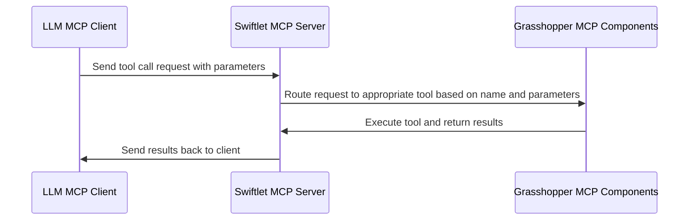
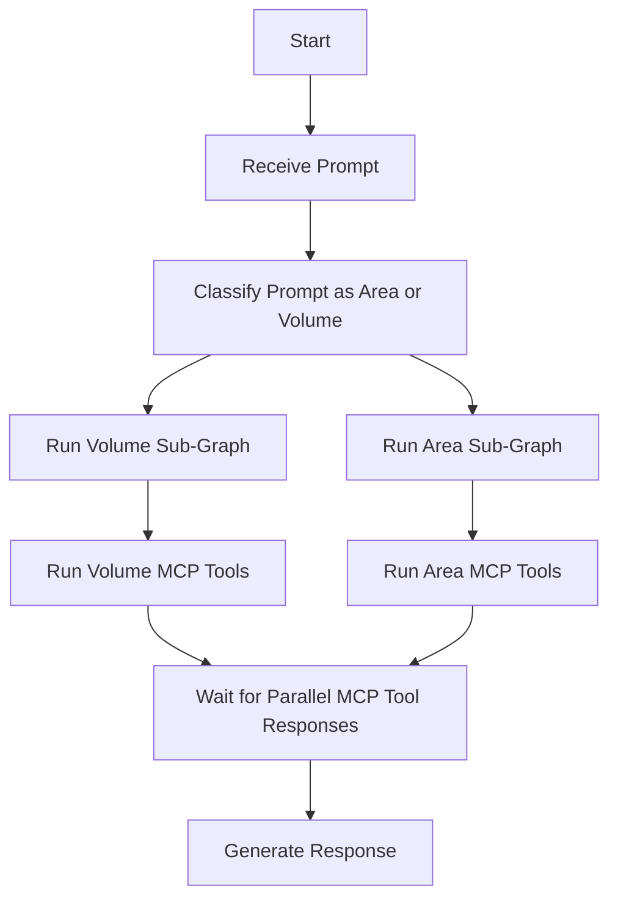

# AIA26 Studio README

This README is intended to be a live document that will be updated throughout the course of the studio project. It provides important information about the structure of the studio and the organization of the Github repository, and technical guidelines for the course. Please make sure to read through this document carefully and refer back to it as needed throughout the studio project. We will also be providing additional documentation and resources in the repository, so be sure to check those out as well. If you have any questions or need clarification on any of the information provided in this README, please don't hesitate to reach out to the instructors for assistance. 

## Github Repository Structure and Guidelines
In this repository, you will find a directory for each team, labeled `team_01`, `team_02`, etc. Each team directory contains two Grasshopper Cluster files: one for MCP Tool definitions and one for MCP Tool results. Additionally, there is a working test Grasshopper definition in each team directory that is set up to run the Swiftlet MCP Server and expose only that team's tools defined in the clusters for testing with an LLM MCP Client.

You'll also find a `python` directory that contains a minimal implementation of a Python agent using LangGraph and MCP tools. This implementation is designed to be a starting point for your development, and you will need to modify and extend it to create the more sophisticated agents required for the studio project.

Each team will have a separate branch in the repository where they will develop their MCP Tools and agent implementations. The main branch will be used to merge the final versions of the tools and agents from each team, creating a unified codebase that contains all the MCP Tools and agent implementations developed by the different teams. **It is crucial that your team only works within your designated branch and folder and does not modify any other team's files or branches.** This will help prevent conflicts and ensure that each team's work is properly isolated until we are ready to merge everything together at the end of the studio project.

Feel free to add any additional files or directories within your team's folder as needed for your development, but please do not modify any files outside of your team's designated area. If you need to add shared resources or documentation that is relevant to all teams, please coordinate with the instructors to determine the best way to include that information without causing conflicts in the codebase.

Check out this link for information about managing branches on Github Desktop: https://docs.github.com/en/desktop/making-changes-in-a-branch/managing-branches-in-github-desktop

### Team Base Directory

The `team_base` directory contains the base example files for each team to start with. This includes the Grasshopper Cluster files for MCP Tool definitions and results, as well as the working test Grasshopper definition that is set up to run the Swiftlet MCP Server. We have copied these into each team's respective directory to provide a starting point for your development. But if you need to refer back to the original base files, you can always find them in the `team_base` directory.

### All Teams Directory

The `all_teams` directory is where the final merged versions of the MCP Tools can be found. The `tool_cluster.gh` file will allow you to run a Swiftlet MCP Server that exposes all the tools from all the teams, which can be useful for testing and development purposes. We do not want you to modify the `all_teams` directory until we are ready to merge everything together at the end of the studio project, so please focus your development efforts on your team's designated branch and folder until then. If you would like to see a change to the `tool_cluster.gh` file in the `all_teams` directory, please coordinate with the instructors to determine the best way to implement that change.

### Pull Request Process

Each week, each team must make a single pull request to merge their changes from their team branch into the main branch. This pull request should include all the updates and additions made to the MCP Tools and agent implementations for that week. The pull request will be reviewed by the instructors, and once approved, it will be merged into the main branch. This process ensures that all teams are contributing to the shared codebase in an organized manner and allows for any necessary feedback or adjustments to be made before merging. It's important to coordinate with your team members and communicate effectively to ensure that your pull request is complete and ready for review each week. ***The deadline is every Sunday at 11:59 PM, Barcelona time***, so make sure to plan your work accordingly to meet this deadline.

The instructors will review the pull requests each week and only approve them if they only contain changes within the team's designated folder and branch. If any changes are found outside of the team's designated area, the pull request will be rejected, and the team will not be able to merge their changes into the main branch until the following week. This is to ensure that each team's work remains isolated and does not interfere with the work of other teams until we are ready to merge everything together at the end of the studio project.

We will not be testing your tools or agents on a weekly basis, until near the end of the studio project when we will be running a final evaluation. However, it is important that you follow the guidelines and structure outlined in this README and the project documentation to ensure that your tools and agents are developed in a way that is compatible with the overall project requirements and can be successfully integrated into the final codebase.

Check out this link for information about making pull requests on Github Desktop: https://docs.github.com/en/desktop/working-with-your-remote-repository-on-github-or-github-enterprise/creating-an-issue-or-pull-request-from-github-desktop

### Coordination with Other Teams

It is important to make sure that your tool is not redundant with tools that other teams are building. We encourage you to communicate and coordinate with the other teams to ensure that you are building unique and complementary tools that can work together effectively in the final project. This will help create a more robust and versatile set of MCP Tools for the agents to use, and will also foster collaboration and knowledge sharing among the different teams.

## Grasshopper MCP Tools

Your application can interact with Rhino Grasshopper through the MCP Tools that your team defines.  The goal is to build a single repository that contains all the MCP Tools created by the different teams, allowing for agents created by different teams to access and use each other's tools.

### Team Files

Each team will be responsible for encapsulating their MCP Tool Grasshopper definitions into two GH Clusters, one for tool definitions and one for tool results. The clusters are already created and each team has a folder in the `gh` directory where they can find their respective clusters.

For example, for team 1, they will find the `team_01` folder in the `gh` directory, which contains the `team_01_definition_cluster.ghcluster` and `team_01_result_cluster.ghcluster` files. Each team should populate these clusters with their respective tool definitions and results, ensuring that they follow the structure and guidelines provided in the project documentation.

Also, in the team folders, there are working test Grasshopper definitions that can be used to test the functionality of the MCP Tools. For team 1, they will find the `team_01_working.gh` file. These test definitions are meant to help teams verify that their tool definitions and results are correctly integrated into the clusters, and run Swiftlet Servers that expose the tools for use by an LLM MCP Client. Teams should not modify these test definitions, but rather use them to test their clusters and ensure that everything is working as expected. If any issues arise during testing, teams should refer to the project documentation or seek assistance from the instructors, preferably Scott.

### Working with the Swiftlet Clusters

#### MCP Tool Definition

When defining your MCP Tools in the Grasshopper clusters, it's important to follow the Swiftlet MCP node documentation.  These can be found here: [Swiftlet MCP Node Documentation](https://github.com/enmerk4r/Swiftlet/wiki/MCP)

I'm including an abridged version of the documentation here for quick reference, but please refer to the full documentation for more details and examples.

###### Parameter Definition
When defining your MCP Tools, you will need to specify the parameters for each tool. Each parameter requires a Name, Type, Description, and Required boolean. The Name is a unique identifier for the parameter, the Type specifies the data type of the parameter (e.g., string, integer, boolean), the Description provides a brief explanation of what the parameter does, and the Required boolean indicates whether the parameter is mandatory for the tool to function properly.


###### Tool Definition
When defining your MCP Tools, you will need to specify the tool's Name, Description, and the input parameters. The Name is a unique identifier for the tool with no spaces, the Description provides a brief explanation of what the tool does, and the input parameters define the data that the tool requires. The description is important for LLMs to understand the purpose of the tool and how to use it effectively. The input parameters should be clearly defined with their respective types and descriptions to ensure that users can provide the correct data when using the tool.


#### MCP Results

Tool calls need to be routed to the correct set of nodes, to create the correct output for the LLM MCP Client. I have already built the necessary infrastructure in the working test definitions for each team, and in the result clusters.  However, as you build out your tool definitions in the definition clusters, you will need to ensure that the tool calls are correctly routed to the result clusters. This involves defining the names of the tools in the definition clusters and ensuring that the corresponding tool name list in the result clusters is updated accordingly. 

I have included tree panels in the working test definitions that shows the tool names in both clusters to help you compare and ensure that they are matching.  


You will need to make sure that the tool names and the calculation logic are in the same order within the result cluster, so that when a tool call is made from the LLM MCP Client, it is routed to the correct set of nodes in the result cluster to generate the appropriate output. This is crucial for ensuring that the tools function correctly and provide the expected results when called by the LLM MCP Client. If there are any discrepancies in the tool names or their order, it could lead to errors or incorrect outputs when the tools are used. Therefore, it's important to carefully manage and update both the definition and result clusters as you build out your MCP Tools.


It is important the output variables are named in a way that matches the Tool's description in the definition cluster, so that when the LLM MCP Client receives the output, it can correctly interpret and utilize the results based on the tool's intended functionality. You may need to experiment with the descriptions and output variable names to find the right balance of clarity and functionality for the LLM MCP Client to effectively use the tools you have created, especially if you are trying to capture more complex data or more nuanced results.

You will also need to make sure that the OK output of the Tool Response node is connected to the Gate Or node's input in the result cluster, so that when a tool call is successfully processed, it allows the result to be logged correctly in the Data Recorder node.

### Running the Swiftlet Server

The Swiftlet MCP Server is a separate .exe application that the MCP Server Grasshopper component communicates with. When you run the MCP Server component in Grasshopper, it starts the Swiftlet MCP Server application in the background, which listens for incoming requests from the LLM MCP Client on a specified local network port. The MCP Server component in Grasshopper sends the tool definitions and results to the Swiftlet MCP Server, which then exposes these tools for use by the LLM MCP Client. When you make a tool call from the LLM MCP Client, it sends a request to the Swiftlet MCP Server, which then routes the request to the appropriate tool in the Grasshopper definition based on the tool name and parameters. The Swiftlet MCP Server processes the request, executes the corresponding tool in Grasshopper, and returns the results back to the LLM MCP Client. 



#### Finding a Free Port

We have built a C# script that runs in Grasshopper to help you find a free port on your local network to use for the Swiftlet MCP Server. This script is included in the working test definitions for each team, and it outputs the first available port in a specified range, defaulted to 3001 - 3100. This script is already connected to the port input of the MCP Server component in the working test definitions, so when you run the definition, it will automatically find a free port and use it for the Swiftlet MCP Server. You can modify the range of ports that the script checks by changing the `startPort` and `endPort` variables in the script. Check the panel output to see which port has been selected for the Swiftlet MCP Server, and make sure to use that same port when configuring your LLM MCP Client to connect to the server.

### Testing with LM Studio or Claude Desktop

An easy way to test your MCP Tools is to use an LLM MCP Client like LM Studio or Claude Desktop. These clients allow you to make tool calls to the Swiftlet MCP Server and see the results in real-time. To set this up, you will need to configure your LLM MCP Client to connect to the Swiftlet MCP Server using the local network port that was selected by the free port script in Grasshopper. Once you have the connection established, you can start making tool calls from the LLM MCP Client, and you should see the results being returned from the Swiftlet MCP Server based on the tools you have defined in your Grasshopper clusters. 

#### Setting up mcp.json

To connect your LLM MCP Client to the Swiftlet MCP Server, you will need to set up an `mcp.json` configuration file that specifies the connection details for the server. Luckily the MCP Server component in the working test definitions already outputs the necessary information for the `mcp.json` file, including the port number that the Swiftlet MCP Server is listening on. To find this, you can right click on the MCP Server component in Grasshopper and select "Copy MCP Config". This will copy the necessary configuration information to your clipboard, which you can then paste into your `mcp.json` file in the appropriate format. 

If you already have other MCP Tools defined in your LLM MCP Client, copying and pasting the configuration information from the MCP Server component in Grasshopper will remove those existing tool definitions from your `mcp.json` file, so you will need to make sure to add the new configuration information for the Swiftlet MCP Server while keeping any existing tool definitions intact. This may involve manually merging the new configuration information with your existing `mcp.json` file to ensure that all of your tools are properly defined and can be accessed by the LLM MCP Client. We can help with this process if needed, just reach out to the instructors for assistance.

###### Predefining Ports for mcp.json

Unfortunately, the mcp.json file requires a specific port number to connect to the Swiftlet MCP Server, which can be problematic if the port number changes each time you run the Grasshopper definition. To address this issue, you can predefine a specific port number in your `mcp.json` file and then modify it to match the port number that is selected by the free port script in Grasshopper each time you run the definition. This way, you can ensure that your LLM MCP Client is always configured to connect to the correct port for the Swiftlet MCP Server, even if the port number changes.


On my testing setup, I have created duplicate `mcp.json` entries for ports 3001, 3002, and 3003, which are the ports that are most commonly selected by the free port script in Grasshopper *on my machine*. This allows me to quickly switch between these predefined ports in my `mcp.json` file without having to manually edit the file each time I run the Grasshopper definition. However, keep in mind that the port number selected by the free port script may vary on different machines, so you may need to adjust your predefined ports accordingly based on the output from the free port script in your Grasshopper definition.

### LM Studio

LM Studio is an LLM frontend application that by default, allows you to run local LLMs on your machine and also supports making tool calls to external applications like the Swiftlet MCP Server. If your computer is powerful enough to run a local LLM, you can use LM Studio to test your MCP Tools without needing to set up an account with an external LLM provider. However, if you want to use an external LLM provider, you can also configure LM Studio to connect to those services and make tool calls from there as well, such as Claude or OpenAI, or any OpenAI APi compatible endpoint, such as Cloudflare. We can help you set up LM Studio and configure it to connect to the Swiftlet MCP Server if you need assistance, just reach out to the instructors for support.

LM Studio will not be the engine for the studio project, but it is a useful tool for testing your MCP Tools and seeing how they interact with an LLM in real-time. It provides a user-friendly interface for making tool calls and viewing the results, which can be helpful for debugging and refining your tools as you develop them in Grasshopper.

### Claude Desktop

Claude Desktop is another LLM frontend application that allows you to connect to the Swiftlet MCP Server and make tool calls from there. Similar to LM Studio, Claude Desktop provides an interface for testing your MCP Tools and seeing how they interact with an LLM in real-time. Claude also supports more agentic interactions, so if you are interested in testing more complex workflows or agent-based interactions with your MCP Tools, Claude Desktop may be a good option to explore. We can also help you set up Claude Desktop and configure it to connect to the Swiftlet MCP Server if you need assistance, just reach out to the instructors for support.

Again, Claude Desktop will not be the engine for the studio project, just a testing tool.

### Package Management

To ensure that we can manage dependencies and keep our Grasshopper environments consistent across different machines, we will need to be thoughtful on the packages used in the Grasshopper definitions.  Each team should limit their use of external packages to those that are absolutely necessary and ensure that any required packages are clearly documented. This will help prevent conflicts and make it easier to set up the development environment on different machines.

Test all Grasshopper packages to make sure they are compatible with the Swiftlet MCP Tools.  It would be impossible for the instruction team to test every possible package combination on every machine, so it is important that each team takes responsibility for ensuring that the packages they use are compatible with the MCP Tools and do not introduce conflicts.

Please keep a record of all the packages you use in your Grasshopper definitions, including their versions, so that other team members can replicate your environment.

## Python Agent (LangGraph + MCP)

The repository now includes a minimal Python agent implementation in `python/main.py`.
This implementation is strict fail-fast by design: no retry, no fallback, and no recovery layer.

### Python Environment

It is highly recommended to use a virtual environment for the Python agent to avoid conflicts with other Python packages on your system. A simple option is to use `venv`:

```bash
python -m venv .venv # This creates a virtual environment directory named '.venv'
& .\.venv\Scripts\Activate.ps1 # On Windows PowerShell this sets the current session to use the virtual environment
```

A virtual environment helps isolate the Python dependencies for this project from other projects on your system, reducing the risk of version conflicts, and making it easier to manage the installed packages.

### Install

```bash
pip install -r requirements.txt
```

### Configure (OpenAI-Compatible Only)


#### Environment Variables (.env)
You will need to set the appropriate environment variables in a `.env` file based on the LLM provider you are using. An example `.env` file is provided as `.env.example`.

We currently support the following LLM providers: "local", "google", "cloudflare", "openai", and "anthropic". You should set the `LLM_PROVIDER` variable in your `.env` file to the provider you want to use. Depending on the provider, you will also need to set additional environment variables such as API keys and model names. We do not expect you to use multiple providers simultaneously, however you should coordinate with your team to ensure consistency in the LLM provider being used for the project.

I suggest starting with using the "cloudflare" provider, as it offers a free tier and does not require a credit card, and serves open weight models. This makes it a convenient option for initial testing and development without incurring costs, adds control to the llm performance, and helps future proof your setup. For more information, see the Cloudflare Workers AI documentation at https://developers.cloudflare.com/workers-ai/.

Additionally, you can set the `DEBUG_GRAPH` and `MAX_ITERATIONS` environment variables in your `.env` file to control the debugging output and the maximum number of iterations for the StateGraph, respectively. `DEBUG_GRAPH` should be set to "true" to enable step traces, and `MAX_ITERATIONS` should be set to an integer value representing the maximum number of iterations.

#### MCP Endpoint Configuration
MCP endpoint settings are loaded from `mcp.json` in the repository root.
The agent uses the first server entry in `mcpServers`.
Supported endpoint fields in that server entry are `url` or `args[0]`.

If you need to run tools from multiple MCP endpoints, you can add additional server entries in the `mcpServers` array in `mcp.json`. The agent will use the first server entry by default, but you can modify the agent code to select a different server entry if needed.

mcp.json is included in the .gitignore file since the file's contents will be unique to each developer's environment. An example `mcp.json` file is provided in the repository as `mcp.example.json`. You can use this example file as a template to create your own `mcp.json` with the appropriate MCP endpoint settings for your environment (see above for details on copying from Grasshopper).

### Run

```bash
python team_01/python/main.py "Use available tools to solve this prompt"
```

The script prints selected model/base URL, MCP endpoint information, discovered tool count, and final response. If DEBUG_GRAPH is set to true, it will also print step traces of the StateGraph execution, and the intermediate states of the agent as it processes the prompt. This example is for team 1, so make sure to change the path to the main.py file for your respective team when running the script.

### Default Agent Graph

The agent graph is in `python/agent_graph.py` and defines the default workflow for the Python agent using LangGraph and MCP tools. It specifies how the agent should process prompts, interact with the MCP tools, and generate responses.



You will need to modify `python/agent_graph.py` if you want to change the default workflow of the Python agent. This file defines how the agent processes prompts, interacts with MCP tools, and generates responses. The implementation here is designed to be minimal and fail-fast, meaning it does not include retries, fallbacks, or recovery layers. You can extend or modify this graph to suit your specific needs for the studio project.

Also, the current implementation runs two sub-graphs in parallel: one for volume calculations and one for area calculations. Each sub-graph is responsible for invoking the appropriate MCP tools for its domain, and the results are then combined into a final response. The sub-graphs use the same code structure and logic, but operate on different sets of tools specific to their respective domains, using the name of the domain to determine which tools to use. For example, the volume sub-graph will only use tools with `volume` in their name, and the area sub-graph will only use tools with `area` in their name.

The agent first classifies the user's prompt to determine whether it is related to volume or area. Based on this classification, it routes the prompt to the appropriate sub-graph, which then invokes the relevant MCP tools for that domain. Once the sub-graphs complete their processing, the results are combined into a final response that is returned to the user.

We attempted to write this example such that additional parallel sub-graphs could be added easily by following the same pattern: classify the prompt, route to the appropriate sub-graph, run the domain-specific MCP tools, and then combine the results. However, this is still a simple implementation, and we expect more complex state management, error handling, and orchestration logic to be required for the more sophisticated agents you will develop over the course.

As much as possible, we have attempted to containerize the graph nodes to make them modular and reusable. Each node in the graph is designed to perform a specific task, and by containerizing them, you can easily swap out or update individual nodes without affecting the rest of the graph. 

**Before vibe coding, or editing any part of the example file, make sure you understand the structure of the agent graph and the role of each node.** This will help you avoid introducing errors and ensure that your modifications are consistent with the overall design of the agent. LangGraph has a comprehensive set of documentation and examples that can help you understand how to work with graph nodes, define workflows, and manage state transitions. You can find more information in the LangGraph documentation at https://docs.langchain.com/oss/python/langgraph/quickstart.

Asking questions and reviewing the documentation now will save you valuable time and effort later when you are modifying the agent graph or adding new functionality. It only gets more complicated from here, so make sure you start from a strong foundation of knowledge.

## Studio Organization and Communication

### Team Numbers

Between weeks 1 and 2, organize yourselves into six teams of 4 or 5 people, and provide your team members to the instructors.  We will use the **Team Numbers** tab of the Google Sheet to keep track of the team members and their respective team numbers. These will not change for the duration of the studio, finalize your team composition before the end of week 1.

### Package List

Since the goal of the studio is to build a shared repository of MCP Tools that can be used by agents developed by different teams, we need to keep a list of the packages required by each team. We will use the **Package List** tab of the Google Sheet to document the packages used by each team, along with their versions.  This list must be kept minimal and should only include packages that are absolutely necessary.  All packages added must be tested against the packages already added by other teams to ensure compatibility and prevent conflicts. If you need to use a package that is not already listed, please coordinate with the instructors to test the new package against the existing ones before adding it to the list. 

### Presentation Signups

Sign up for your presentation slot on the **Presentation Signups** tab of the Google Sheet for the order during the weekly studio sessions.