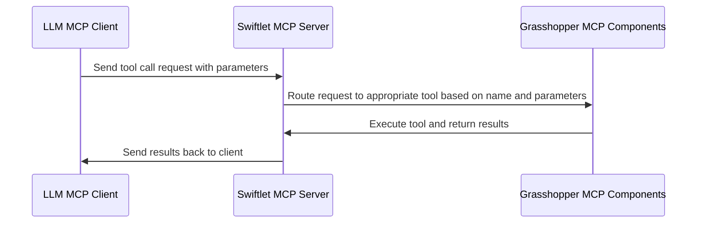
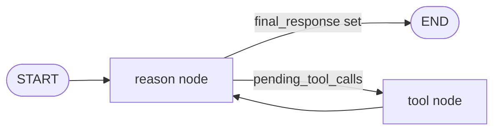

# AIA26 Studio README

## GitHub repository structure and guidelines

Each team has a folder: `team_01`, `team_02`, … `team_06`. Inside **your** folder you will find:

- **`gh/`** — two Grasshopper cluster files (MCP tool **definitions** and **results**) plus a **working test** Grasshopper file (`.gh`) wired to run the Swiftlet MCP server for that team’s tools.
- **`python/`** — a small starter agent (LangGraph + MCP over HTTP) you extend for the studio project.

Work only in **your team’s branch** and **your team’s folder**. Do not edit other teams’ files. You may add files inside your team folder as needed. Shared changes for everyone should be coordinated with the instructors.

| Rule | Why |
|------|-----|
| One branch per team | Keeps merges predictable. |
| Edits only under `team_XX/` | Avoids conflicts until the final integration. |
| Weekly PR into `main` | Instructors review; PRs with changes outside your folder may be rejected. |

**Weekly pull request:** One PR per team per week into `main`, **Sunday 11:59 PM Barcelona time**. Instructors merge after review. Tools and agents are not graded every week; a fuller evaluation happens later, but following this structure keeps the project integrable.

- [Managing branches in GitHub Desktop](https://docs.github.com/en/desktop/making-changes-in-a-branch/managing-branches-in-github-desktop)
- [Creating a pull request from GitHub Desktop](https://docs.github.com/en/desktop/working-with-your-remote-repository-on-github-or-github-enterprise/creating-an-issue-or-pull-request-from-github-desktop)

### `team_base` directory

`team_base` holds an **older reference Python layout** (different graph shape than the current `team_XX/python` tree). It does **not** contain Grasshopper `.gh` / `.ghcluster` files. Your Grasshopper starting files live under **`team_XX/gh/`** in your team folder.

### Combined “all teams” Grasshopper (end of studio)

A single Grasshopper setup that exposes **every** team’s tools may be added later for final integration testing. Until instructors provide that, develop and test inside **your** `team_XX/gh/` definition only.

### Coordination with other teams

Avoid duplicating another team’s tool. Talk to other teams so the final toolbox is complementary and works well together.

---

## Grasshopper MCP tools

The shared goal is one repository where many MCP tools exist so agents can call tools built by different teams.

### Team files (paths that matter)

Clusters and the working definition sit under **`team_XX/gh/`**, not in a repo-wide `gh/` folder.

**Example for team 1:**

- `team_01/gh/team_01_definition_cluster.ghcluster`
- `team_01/gh/team_01_result_cluster.ghcluster`
- `team_01/gh/team_01_working.gh` — test harness and Swiftlet wiring; **use it to run and test your clusters, but do not rework this file** unless instructors say otherwise. Prefer editing the clusters. For help, ask the instructors (Scott is a good contact for Grasshopper/MCP).

New copies of teams may still use `team_01_*` filenames until you replace them with your own assets.

### Working with the Swiftlet clusters

#### MCP tool definition

Follow the official docs: [Swiftlet MCP node documentation](https://github.com/enmerk4r/Swiftlet/wiki/MCP). Below is a short reminder; use the wiki for full detail.

###### Parameter definition

Each parameter needs a **Name**, **Type**, **Description**, and **Required** flag.


###### Tool definition

Each tool needs a **Name** (no spaces), **Description** (helps the LLM choose and use the tool), and **inputs** with clear types and descriptions.


#### MCP results (routing)

Definition and result clusters must stay in sync: **tool names** in the definition cluster must match the list used in the result cluster, and **order** in the result cluster must match how calls are routed (same order as the logic branches). The working `.gh` includes tree panels to compare names side by side.


Name **outputs** clearly so they align with what you promised in the tool description. Connect the **OK** output of the Tool Response node to the **Gate Or** input in the result cluster so successful calls log correctly in the Data Recorder.

### Running the Swiftlet server

Grasshopper’s MCP Server component talks to a separate **Swiftlet** process (on Windows this is typically a `.exe`). The client (LM Studio, Claude Desktop, or the Python agent) sends tool calls to Swiftlet; Swiftlet runs the matching logic in Grasshopper and returns the result.



#### Finding a free port

The working definitions include a **C# script** that picks the first free port in a range (default **3001–3100**) and feeds the MCP Server. Check the panel for the chosen port and use **that** port in your client’s `mcp.json` (or your duplicate port entries). You can change `startPort` / `endPort` in the script if needed.

### Testing with LM Studio or Claude Desktop

Point your MCP client at the **same host and port** Swiftlet is using (from Grasshopper / the free-port panel). Use **Grasshopper → right-click MCP Server → “Copy MCP Config”** to build or update the server block for `mcp.json`.

If you paste a full new config over an existing `mcp.json`, you can wipe other servers—**merge by hand** or ask instructors for help.

###### Predefining ports in `mcp.json`

`mcp.json` needs a fixed URL including the port. If the free-port script picks a different port each run, either update `mcp.json` to match or keep a few duplicate entries (e.g. 3001, 3002, 3003) and enable the one that matches today’s panel output (exact ports vary by machine).


### LM Studio

LM Studio can run **local** models or connect to remote APIs. It is **only for testing** how your Grasshopper tools behave with an LLM—not the final studio “engine.” It can also target OpenAI-compatible endpoints (e.g. Cloudflare). Ask instructors if you want help wiring it to Swiftlet.

### Claude Desktop

Same idea: connect to Swiftlet, call tools, debug workflows—**testing only**, not the final engine.

### Package management (Grasshopper)

Use extra Grasshopper plugins only when necessary, document **name + version**, and verify compatibility with Swiftlet MCP on your machine. The instruction team cannot test every combination.

---

## Python agent (LangGraph + MCP)

Each team uses **`team_01` … `team_06`** with the same layout. Code lives in **`team_XX/python/`**: a small loop (**reason** → **tool** → **reason**) over HTTP JSON-RPC MCP, with shared sample layout JSON as context.

The code is **fail-fast** by design: no automatic retries or recovery layer.

### What you need installed

- **Rhino + Grasshopper** (with **Swiftlet** installed as required for the course).
- **Python 3.10+** on your PATH (the project uses modern type syntax).
- A terminal and **Git** (or GitHub Desktop).

### Quick start (first time)

Do these in order:

1. **Clone** the repo and checkout **your team’s branch**.
2. At the **repository root**, copy **`mcp.example.json`** to **`mcp.json`** and edit the Swiftlet URL/port to match your machine (or use “Copy MCP Config” from Grasshopper after the steps below).
3. Copy **`.env.example`** to **`.env`** at the repo root and fill in **`LLM_PROVIDER`** and the variables for that provider (see below).
4. **Open Rhino**, open your team’s **`team_XX/gh/team_XX_working.gh`**, and run the definition so Swiftlet is listening on the expected port.
5. Create a **virtual environment** (recommended), **activate** it, then from the repo root run **`pip install -r requirements.txt`**.
6. In a terminal: **`cd team_XX/python`** (your team) and run **`python main.py "your instruction here"`**.

If `main.py` cannot reach the MCP server, confirm Grasshopper is running and `mcp.json` points at the correct HTTP endpoint.

### Per-team directory layout

Replace `team_01` with your folder (`team_02`, …).

| Path | Role |
|------|------|
| `layout_input/layout_schema.json` | **Only this file** is loaded by the agent (`bootstrap.py`) as building context. Extra `layout_schema.json` copies under a team folder are not used unless you change the code. |
| `team_01/edited_layout.json` | Written when a tool returns (pretty-printed JSON when possible). |
| `team_01/grasshopper_mcp_requests.txt` | Example `tools/call` payload for debugging/docs. |
| `team_01/gh/` | Grasshopper clusters and working definition. |
| `team_01/python/main.py` | CLI: prompt → `bootstrap()` → `run_agent()` → closes MCP client. |
| `team_01/python/graph.py` | `StateGraph`, `AgentState`, `build_graph()`, `run_agent()` — **main place to change workflow**. |
| `team_01/python/nodes/reason.py` | LLM step and structured decision (`final` vs `tool`). |
| `team_01/python/nodes/tools.py` | Runs MCP `tools/call`, injects `layout_json` from state, writes `edited_layout.json`. |
| `team_01/python/_runtime/bootstrap.py` | Builds `Context` (LLM, MCP, tools, layout, paths). |
| `team_01/python/_runtime/config.py` | Loads repo-root `.env` and `mcp.json`. |
| `team_01/python/_runtime/mcp_client.py` | HTTP MCP client (`initialize`, `tools/list`, `tools/call`). |
| `team_01/python/_runtime/llm.py` | OpenAI-compatible chat + JSON schema from discovered tools. |

Always run commands from **`team_XX/python`** so imports (`graph`, `_runtime`) resolve.

### Python virtual environment

Create the venv **once**, in a folder you remember (repo root is a common choice):

**Windows (PowerShell):**

```powershell
cd C:\path\to\AIA26_Studio
python -m venv .venv
.\.venv\Scripts\Activate.ps1
pip install -r requirements.txt
```

**macOS / Linux:**

```bash
cd /path/to/AIA26_Studio
python3 -m venv .venv
source .venv/bin/activate
pip install -r requirements.txt
```

Use the **same** activated environment whenever you run `pip` or `python main.py`.

### Configure

#### Environment variables (`.env`)

Put **`.env`** at the **repository root** (next to `requirements.txt`). Start from **`.env.example`**.

Set **`LLM_PROVIDER`** to one of: `local`, `google`, `cloudflare`, `openai`, or `anthropic`. Each provider needs its own keys/endpoints as in `.env.example`. Pick **one** provider per team and stay consistent.

**Cloudflare** is a practical default: free tier, no credit card for the Workers AI path described in the course. Docs: [Cloudflare Workers AI](https://developers.cloudflare.com/workers-ai/).

**Anthropic** is configured in code for an OpenAI-compatible style endpoint; if you see failures around structured JSON or tool schemas, switch provider or ask instructors—do not assume it will behave identically to OpenAI.

**`MAX_ITERATIONS`** caps tool rounds (default **`4`** if unset). **`DEBUG_GRAPH`** is read into settings but **the graph does not print step traces yet**; it is reserved until that wiring exists.

#### MCP endpoint (`mcp.json`)

The agent reads **`mcp.json` at the repo root**. It must contain an **`mcpServers`** object. The code uses the **first key** in that object and takes the MCP HTTP URL from **`url`** or from **`args[0]`** (see **`mcp.example.json`**). To use another entry, **put that server first** or edit **`_runtime/config.py`** to select a server key explicitly.

`mcp.json` is **gitignored** (machine-specific). Use **`mcp.example.json`** as a template and Grasshopper’s **Copy MCP Config** when testing Swiftlet.

### Run

```bash
cd team_01/python
python main.py "delete the kitchen"
python main.py "add a window to Bedroom 1"
```

The run lists tools from the MCP server, injects **`layout_input/layout_schema.json`** into the prompt, prints the final reply, and writes tool output to that team’s **`edited_layout.json`** when the response is JSON (otherwise as text).

### Agent graph (`team_XX/python/graph.py`)

**Reason** calls the LLM. If the model returns **`action: "tool"`**, **tool** runs MCP `tools/call` and appends messages; then **reason** runs again until **`action: "final"`**.



- **State:** `messages`, `pending_tool_calls`, `final_response`, `iteration` / `max_iterations`, `tool_catalog`, `layout_json_string`.
- **Allowlist:** Only tools from `tools/list` at startup; unknown names error out.
- **`layout_json`:** If the model puts `layout_json` in arguments, the tool node replaces it with the current full layout string from state.

### Example MCP tool calls (`delete_room`, `add_window`)

`nodes/reason.py` is written to work with layout-editing tools exposed by Grasshopper. Examples include **`delete_room`** and **`add_window`** (names and parameters must match what your definition cluster publishes in **`tools/list`**).

- **`delete_room`:** Resolve the room name (must match the layout JSON—e.g. `rooms[].name` in `layout_input/layout_schema.json`), call with schema-compliant arguments (often `room_name`), then after the tool result reply with **`action: "final"`** and point to **`edited_layout.json`** when appropriate.
- **`add_window`:** Adds a window to the layout (updates the `windows` array and related fields per your MCP tool’s `inputSchema`). Use the parameter names and types from **`tools/list`** / your definition cluster; the layout’s `windows` entries use `id`, `name`, `geometry` (two points), and optional `attributes` such as `roomId`, as in the sample schema.

Example shape for **`delete_room`** (URL/port depend on your setup); see also `team_01/grasshopper_mcp_requests.txt` (copies exist under other teams):

```json
{
  "jsonrpc": "2.0",
  "id": 3,
  "method": "tools/call",
  "params": {
    "name": "delete_room",
    "arguments": {
      "room_name": "kitchen",
      "layout_json": "<stringified layout JSON>"
    }
  }
}
```

For **`add_window`**, the same JSON-RPC envelope applies; only `params.name` and `params.arguments` change to match your Swiftlet tool definition (still including `layout_json` when the tool expects the current layout string, same as above).

The Python client sends these over **HTTP POST** to the endpoint in `mcp.json`.

**Before changing the graph or prompts**, read **`graph.py`**, **`nodes/reason.py`**, and **`nodes/tools.py`** so you understand state and tool arguments.

LangGraph quickstart: https://docs.langchain.com/oss/python/langgraph/quickstart

---

## User Interfaces

The agent you develop will need to work with a CLI (command-line interface) where the user can type instructions and pass in files, such as the layout JSON. We *need* a CLI to create an orchestrator agent that can call your agent and the other teams' agents as sub-agents and allow them to work together. The CLI is also a simple way to test your agent without needing to set up a more complex interface.

In addition to the CLI, you should create a Graphical User Interface (GUI) that allows interaction with your agent.  The GUI will allow your agent to display information, and receive user input.  This is an opportunity to be creative and think about the human-computer interaction aspect of your agent.  As we've discussed in the course, a big challenge is that LLMs are not good at understanding geometric information, and require written information to be able to reason about the geometry.  A well-designed GUI can translate between the geometric and written information, and allow the user to interact with the agent in a more semantic way.  

For example, the GUI could display the current layout, and allow the user to click on the south wall of the kitchen to add a window.  Or the user the could write in a text box "add a window to the south wall of kitchen".  Both examples convey the same information to the agent, but you may prefer one to the other.

### Planning

Before you start coding, we recommend that you plan out your GUI on a sketch or paper.  Think about the window(s) you may need, and what they will show.  Think about the porportion of the window each element will need, and how large the total window should be.  Think about the user flow: what will the user see when they first open the GUI, and what will they do next?  You can consider the interface in a series of states, and how the user transitions between those states.  

### Suggested libraries for the GUI

Below is a table of some libraries you could use to create a GUI for your agent, but not an exhaustive list, if you have other libraries in mind, that's great!

First, consider whether you want a **local** application that runs on the user's machine, like Rhino or Revit would, or a **web-based** application that runs in the browser, such as Miro or Google Docs.  Local applications can be more responsive and have access to the file system, but web-based applications can be more accessible and run on more platforms.

Also consider the **complexity** of the interface you want to create.  A simple library may be easier to learn and develop with, but may limit design options.  

It's always a good idea to read documentation and tutorials and prototype before committing.  

| Library | Description | Pros | Cons | Runtime | Complexity |
|---------|-------------|------|------|---------|------|
| Tkinter | Built-in Python library for creating GUIs. | No additional dependencies, simple to use for basic interfaces. | Limited in design and functionality, may not look modern. | Local | Low |
| PyQt | A set of Python bindings for the Qt application framework. | More powerful and flexible than Tkinter, supports complex interfaces. | Requires installation of PyQt, can be more complex to learn. | Local | Medium |
| Streamlit | A library for creating web apps for machine learning and data science. | Easy to use, great for data visualization, runs in the browser. | Not designed for complex GUIs, often refreshes the whole page on interaction which is slow. | Web-based | Medium |
| Gradio | A library for creating web-based interfaces for machine learning models. | Very easy to use, great for quick demos, runs in the browser. | Limited customization, not ideal for complex interfaces. | Web-based | Low |
| Holoviz Panel | A library for creating interactive web apps and dashboards. | Highly customizable, supports complex interfaces, runs in the browser. | Steeper learning curve, requires installation of Panel and its dependencies. | Web-based | High |
