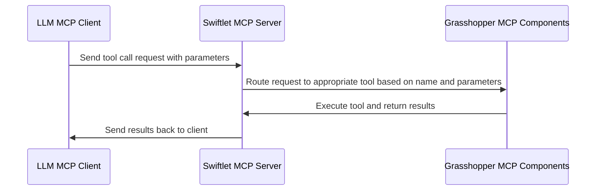

# AIA26 Studio README

## Grasshopper MCP Tools

Your application can interact with Rhino Grasshopper through the MCP Tools that your team defines.  The goal is to build a single repository that contains all the MCP Tools created by the different teams, allowing for agents created by different teams to access and use each other's tools.

### Team Files

Each team will be responsible for encapsulating their MCP Tool Grasshopper definitions into two GH Clusters, one for tool definitions and one for tool results. The clusters are already created and each team has a folder in the `gh` directory where they can find their respective clusters.

For example, for team 1, they will find the `team_01` folder in the `gh` directory, which contains the `team_01_definition_cluster.ghcluster` and `team_01_result_cluster.ghcluster` files. Each team should populate these clusters with their respective tool definitions and results, ensuring that they follow the structure and guidelines provided in the project documentation.

Also, in the team folders, there are working test Grasshopper definitions that can be used to test the functionality of the MCP Tools. For team 1, they will find the `team_01_working.gh` file. These test definitions are meant to help teams verify that their tool definitions and results are correctly integrated into the clusters, and run Swiftlet Servers that expose the tools for use by an LLM MCP Client. Teams should not modify these test definitions, but rather use them to test their clusters and ensure that everything is working as expected. If any issues arise during testing, teams should refer to the project documentation or seek assistance from the instructors, preferably Scott.

### Working with the Swiftlet Clusters

#### MCP Tool Definition

When defining your MCP Tools in the Grasshopper clusters, it's important to follow the Swiftlet MCP node documentation.  These can be found here: [Swiftlet MCP Node Documentation](https://github.com/enmerk4r/Swiftlet/wiki/MCP)

I'm including an abridged version of the documentation here for quick reference, but please refer to the full documentation for more details and examples.

###### Parameter Definition
When defining your MCP Tools, you will need to specify the parameters for each tool. Each parameter requires a Name, Type, Description, and Required boolean. The Name is a unique identifier for the parameter, the Type specifies the data type of the parameter (e.g., string, integer, boolean), the Description provides a brief explanation of what the parameter does, and the Required boolean indicates whether the parameter is mandatory for the tool to function properly.


###### Tool Definition
When defining your MCP Tools, you will need to specify the tool's Name, Description, and the input parameters. The Name is a unique identifier for the tool with no spaces, the Description provides a brief explanation of what the tool does, and the input parameters define the data that the tool requires. The description is important for LLMs to understand the purpose of the tool and how to use it effectively. The input parameters should be clearly defined with their respective types and descriptions to ensure that users can provide the correct data when using the tool.


#### MCP Results

Tool calls need to be routed to the correct set of nodes, to create the correct output for the LLM MCP Client. I have already built the necessary infrastructure in the working test definitions for each team, and in the result clusters.  However, as you build out your tool definitions in the definition clusters, you will need to ensure that the tool calls are correctly routed to the result clusters. This involves defining the names of the tools in the definition clusters and ensuring that the corresponding tool name list in the result clusters is updated accordingly. 

I have included tree panels in the working test definitions that shows the tool names in both clusters to help you compare and ensure that they are matching.  


You will need to make sure that the tool names and the calculation logic are in the same order within the result cluster, so that when a tool call is made from the LLM MCP Client, it is routed to the correct set of nodes in the result cluster to generate the appropriate output. This is crucial for ensuring that the tools function correctly and provide the expected results when called by the LLM MCP Client. If there are any discrepancies in the tool names or their order, it could lead to errors or incorrect outputs when the tools are used. Therefore, it's important to carefully manage and update both the definition and result clusters as you build out your MCP Tools.


It is important the output variables are named in a way that matches the Tool's description in the definition cluster, so that when the LLM MCP Client receives the output, it can correctly interpret and utilize the results based on the tool's intended functionality. You may need to expirement with the descriptions and output variable names to find the right balance of clarity and functionality for the LLM MCP Client to effectively use the tools you have created, especially if you are trying to capture more complex data or more nuanced results.

### Running the Swiftlet Server

The Swiftlet MCP Server is a separate .exe application that the MCP Server Grasshopper component communicates with. When you run the MCP Server component in Grasshopper, it starts the Swiftlet MCP Server application in the background, which listens for incoming requests from the LLM MCP Client on a specified local network port. The MCP Server component in Grasshopper sends the tool definitions and results to the Swiftlet MCP Server, which then exposes these tools for use by the LLM MCP Client. When you make a tool call from the LLM MCP Client, it sends a request to the Swiftlet MCP Server, which then routes the request to the appropriate tool in the Grasshopper definition based on the tool name and parameters. The Swiftlet MCP Server processes the request, executes the corresponding tool in Grasshopper, and returns the results back to the LLM MCP Client. 



#### Finding a Free Port

We have built a C# script that runs in Grasshopper to help you find a free port on your local network to use for the Swiftlet MCP Server. This script is included in the working test definitions for each team, and it outputs the first available port in a specified range, defaulted to 3001 - 3100. This script is already connected to the port input of the MCP Server component in the working test definitions, so when you run the definition, it will automatically find a free port and use it for the Swiftlet MCP Server. You can modify the range of ports that the script checks by changing the `startPort` and `endPort` variables in the script. Check the panel output to see which port has been selected for the Swiftlet MCP Server, and make sure to use that same port when configuring your LLM MCP Client to connect to the server.

### Testing with LM Studio or Claude Desktop

An easy way to test your MCP Tools is to use an LLM MCP Client like LM Studio or Claude Desktop. These clients allow you to make tool calls to the Swiftlet MCP Server and see the results in real-time. To set this up, you will need to configure your LLM MCP Client to connect to the Swiftlet MCP Server using the local network port that was selected by the free port script in Grasshopper. Once you have the connection established, you can start making tool calls from the LLM MCP Client, and you should see the results being returned from the Swiftlet MCP Server based on the tools you have defined in your Grasshopper clusters. 

#### Setting up mcp.json

To connect your LLM MCP Client to the Swiftlet MCP Server, you will need to set up an `mcp.json` configuration file that specifies the connection details for the server. Luckily the MCP Server component in the working test definitions already outputs the necessary information for the `mcp.json` file, including the port number that the Swiftlet MCP Server is listening on. To find this, you can right click on the MCP Server component in Grasshopper and select "Copy MCP Config". This will copy the necessary configuration information to your clipboard, which you can then paste into your `mcp.json` file in the appropriate format. 

If you already have other MCP Tools defined in your LLM MCP Client, copying and pasting the configuration information from the MCP Server component in Grasshopper will remove those existing tool definitions from your `mcp.json` file, so you will need to make sure to add the new configuration information for the Swiftlet MCP Server while keeping any existing tool definitions intact. This may involve manually merging the new configuration information with your existing `mcp.json` file to ensure that all of your tools are properly defined and can be accessed by the LLM MCP Client. We can help with this process if needed, just reach out to the instructors for assistance.

###### Predefining Ports for mcp.json

Unfortunately, the mcp.json file requires a specific port number to connect to the Swiftlet MCP Server, which can be problematic if the port number changes each time you run the Grasshopper definition. To address this issue, you can predefine a specific port number in your `mcp.json` file and then modify it to match the port number that is selected by the free port script in Grasshopper each time you run the definition. This way, you can ensure that your LLM MCP Client is always configured to connect to the correct port for the Swiftlet MCP Server, even if the port number changes.


On my testing setup, I have created duplicate `mcp.json` entries for ports 3001, 3002, and 3003, which are the ports that are most commonly selected by the free port script in Grasshopper *on my machine*. This allows me to quickly switch between these predefined ports in my `mcp.json` file without having to manually edit the file each time I run the Grasshopper definition. However, keep in mind that the port number selected by the free port script may vary on different machines, so you may need to adjust your predefined ports accordingly based on the output from the free port script in your Grasshopper definition.

### LM Studio

LM Studio is an LLM frontend application that by default, allows you to run local LLMs on your machine and also supports making tool calls to external applications like the Swiftlet MCP Server. If your computer is powerful enough to run a local LLM, you can use LM Studio to test your MCP Tools without needing to set up an account with an external LLM provider. However, if you want to use an external LLM provider, you can also configure LM Studio to connect to those services and make tool calls from there as well, such as Claude or OpenAI, or any OpenAI APi compatible endpoint, such as Cloudflare. We can help you set up LM Studio and configure it to connect to the Swiftlet MCP Server if you need assistance, just reach out to the instructors for support.

LM Studio will not be the engine for the studio project, but it is a useful tool for testing your MCP Tools and seeing how they interact with an LLM in real-time. It provides a user-friendly interface for making tool calls and viewing the results, which can be helpful for debugging and refining your tools as you develop them in Grasshopper.

### Claude Desktop

Claude Desktop is another LLM frontend application that allows you to connect to the Swiftlet MCP Server and make tool calls from there. Similar to LM Studio, Claude Desktop provides an interface for testing your MCP Tools and seeing how they interact with an LLM in real-time. Claude also supports more agentic interactions, so if you are interested in testing more complex workflows or agent-based interactions with your MCP Tools, Claude Desktop may be a good option to explore. We can also help you set up Claude Desktop and configure it to connect to the Swiftlet MCP Server if you need assistance, just reach out to the instructors for support.

Again, Claude Desktop will not be the engine for the studio project, just a testing tool.

## Package Management

To ensure that we can manage dependencies and keep our Grasshopper environments consistent across different machines, we will need to be thoughtful on the packages used in the Grasshopper definitions.  Each team should limit their use of external packages to those that are absolutely necessary and ensure that any required packages are clearly documented. This will help prevent conflicts and make it easier to set up the development environment on different machines.

Test all Grasshopper packages to make sure they are compatible with the Swiftlet MCP Tools.  It would be impossible for the instruction team to test every possible package combination on every machine, so it is important that each team takes responsibility for ensuring that the packages they use are compatible with the MCP Tools and do not introduce conflicts.

Please keep a record of all the packages you use in your Grasshopper definitions, including their versions, so that other team members can replicate your environment.

## Python Agent (LangGraph + MCP)

The repository now includes a minimal Python agent implementation in `python/main.py`.
This implementation is strict fail-fast by design: no retry, no fallback, and no recovery layer.

### Install

```bash
pip install -r requirements.txt
```

### Configure (OpenAI-Compatible Only)

Set environment variables before running:

- `OPENAI_API_KEY`
- `OPENAI_BASE_URL` (must include `/v1`, example: `http://localhost:1234/v1`)
- `OPENAI_MODEL` (example: `qwen2.5-7b-instruct`)

The app auto-loads `.env` from repository root before reading these values.
`OPENAI_API_KEY` must be non-empty.

MCP endpoint settings are loaded from `mcp.json` in the repository root.
The agent uses the first server entry in `mcpServers`.
Supported endpoint fields in that server entry are `url` or `args[0]`.

Optional:

- `REQUEST_TIMEOUT_SECONDS` (default `30`)
- `MAX_ITERATIONS` (default `4`)

### Run

```bash
python python/main.py "Use available tools to solve this prompt"
```

The script prints selected model/base URL, MCP endpoint information, discovered tool count, and final response.